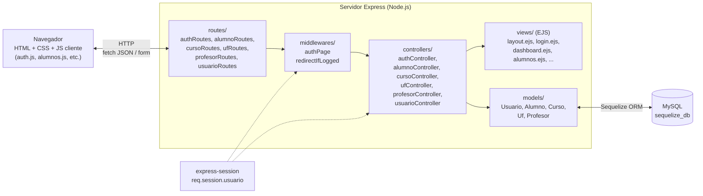

# Capas de la aplicación

Arquitectura en capas del CRM: cómo se organizan las responsabilidades entre cliente, servidor y base de datos.

```mermaid
flowchart LR
    Browser["Navegador<br/>HTML + CSS + JS cliente<br/>(auth.js, alumnos.js, etc.)"]

    Browser <-->|"HTTP<br/>fetch JSON / form"| Routes

    subgraph Servidor["Servidor Express (Node.js)"]
        Routes["routes/<br/>authRoutes, alumnoRoutes,<br/>cursoRoutes, ufRoutes,<br/>profesorRoutes, usuarioRoutes"]
        Routes --> MW["middlewares/<br/>authPage<br/>redirectIfLogged"]
        MW --> Controllers["controllers/<br/>authController,<br/>alumnoController, cursoController,<br/>ufController, profesorController,<br/>usuarioController"]
        Controllers --> Views["views/ (EJS)<br/>layout.ejs, login.ejs,<br/>dashboard.ejs, alumnos.ejs, ..."]
        Controllers --> Models["models/<br/>Usuario, Alumno, Curso,<br/>Uf, Profesor"]
    end

    Models <-->|"Sequelize ORM"| DB[("MySQL<br/>sequelize_db")]

    Session["express-session<br/>req.session.usuario"] -.-> MW
    Session -.-> Controllers
```
