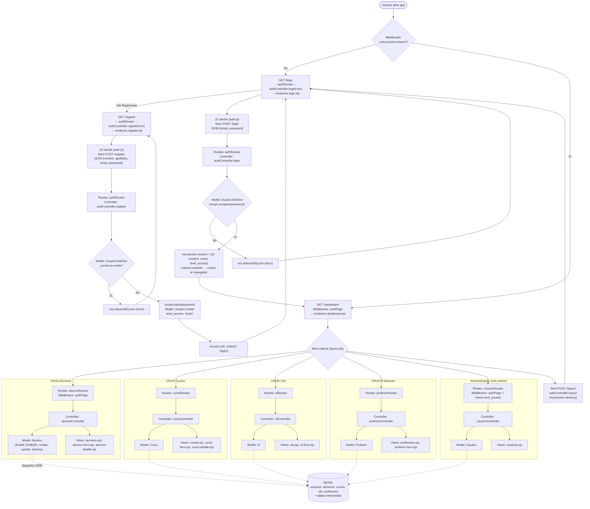

# Flujo de la aplicación

Diagrama de flujo completo del CRM mostrando rutas, controllers, models y vistas involucrados en cada acción.

```mermaid
flowchart TD
    Start([Usuario abre app]) --> Login{"Middleware<br/>¿req.session.usuario?"}

    Login -->|No| LoginPage["GET /login<br/>→ authRoutes → authController.loginForm<br/>→ renderiza login.ejs"]
    Login -->|Sí| Dashboard

    LoginPage -->|"link Registrarse"| RegisterPage["GET /register<br/>→ authRoutes → authController.registerForm<br/>→ renderiza register.ejs"]

    RegisterPage --> SubmitReg["JS cliente (auth.js)<br/>fetch POST /register<br/>JSON {nombre, apellidos, email, password}"]
    SubmitReg --> PostReg["Routes: authRoutes<br/>Controller: authController.register"]
    PostReg --> ValidaReg{"Model: Usuario.findOne<br/>¿email ya existe?"}
    ValidaReg -->|Sí| ErrorReg["res.status(400).json {error}"]
    ErrorReg --> RegisterPage
    ValidaReg -->|No| Hashea["bcrypt.hash(password)<br/>Model: Usuario.create<br/>nivel_acceso: 'lector'"]
    Hashea --> RedirectLogin["res.json {ok, redirect: '/login'}"]
    RedirectLogin --> LoginPage

    LoginPage --> Submit["JS cliente (auth.js)<br/>fetch POST /login<br/>JSON {email, password}"]
    Submit --> PostLogin["Routes: authRoutes<br/>Controller: authController.login"]
    PostLogin --> Valida{"Model: Usuario.findOne<br/>bcrypt.compare(password)"}
    Valida -->|No| Error["res.status(400).json {error}"]
    Error --> LoginPage
    Valida -->|Sí| CreaSesion["req.session.usuario = {id, nombre, email, nivel_acceso}<br/>express-session → cookie al navegador"]
    CreaSesion --> Dashboard

    Dashboard["GET /dashboard<br/>Middleware: authPage<br/>→ renderiza dashboard.ejs"]
    Dashboard --> Nav{"Menú lateral (layout.ejs)"}

    Nav --> Alumnos
    Nav --> Cursos
    Nav --> UFs
    Nav --> Profesores
    Nav --> Admin
    Nav --> Logout

    subgraph CRUDAlumnos["CRUD Alumnos"]
        Alumnos["Routes: alumnoRoutes<br/>Middleware: authPage"]
        Alumnos --> AC["Controller: alumnoController"]
        AC --> AM["Model: Alumno<br/>(findAll, findByPk, create, update, destroy)"]
        AC --> AV["Views: alumnos.ejs, alumno-form.ejs, alumno-detalle.ejs"]
    end

    subgraph CRUDCursos["CRUD Cursos"]
        Cursos["Routes: cursoRoutes"]
        Cursos --> CC["Controller: cursoController"]
        CC --> CM["Model: Curso"]
        CC --> CV["Views: cursos.ejs, curso-form.ejs, curso-detalle.ejs"]
    end

    subgraph CRUDUFs["CRUD UFs"]
        UFs["Routes: ufRoutes"]
        UFs --> UC["Controller: ufController"]
        UC --> UM["Model: Uf"]
        UC --> UV["Views: ufs.ejs, uf-form.ejs"]
    end

    subgraph CRUDProfesores["CRUD Profesores"]
        Profesores["Routes: profesorRoutes"]
        Profesores --> PC["Controller: profesorController"]
        PC --> PM["Model: Profesor"]
        PC --> PV["Views: profesores.ejs, profesor-form.ejs"]
    end

    subgraph CRUDAdmin["Administración (solo admin)"]
        Admin["Routes: usuarioRoutes<br/>Middleware: authPage + check nivel_acceso"]
        Admin --> UsC["Controller: usuarioController"]
        UsC --> UsM["Model: Usuario"]
        UsC --> UsV["Views: usuarios.ejs"]
    end

    Logout["fetch POST /logout<br/>authController.logout<br/>req.session.destroy()"] --> LoginPage

    AM -.Sequelize ORM.-> DB[("MySQL<br/>usuarios, alumnos, cursos, ufs, profesores<br/>+ tablas intermedias")]
    CM -.-> DB
    UM -.-> DB
    PM -.-> DB
    UsM -.-> DB
```
