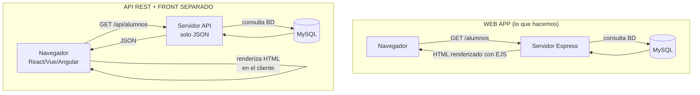
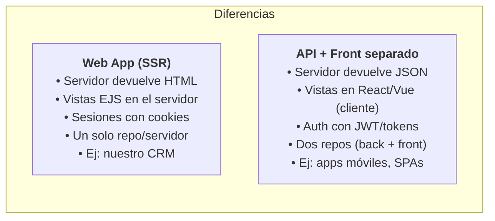

# Web App vs API REST + Front separado

Comparativa entre la arquitectura que usamos en este CRM (web app con SSR) y la alternativa de API REST con front separado.

## Flujo

```mermaid
flowchart TB
    subgraph webapp["WEB APP (lo que hacemos)"]
        direction LR
        B1[Navegador]
        B1 -->|"GET /alumnos"| S1[Servidor Express]
        S1 -->|"consulta BD"| DB1[(MySQL)]
        DB1 --> S1
        S1 -->|"HTML renderizado con EJS"| B1
    end

    subgraph api["API REST + FRONT SEPARADO"]
        direction LR
        B2[Navegador<br/>React/Vue/Angular]
        B2 -->|"GET /api/alumnos"| S2[Servidor API<br/>solo JSON]
        S2 -->|"consulta BD"| DB2[(MySQL)]
        DB2 --> S2
        S2 -->|"JSON"| B2
        B2 -->|"renderiza HTML<br/>en el cliente"| B2
    end
```

## Diferencias

```mermaid
flowchart TD
    subgraph diff["Diferencias"]
        direction TB
        D1["<b>Web App (SSR)</b><br/>• Servidor devuelve HTML<br/>• Vistas EJS en el servidor<br/>• Sesiones con cookies<br/>• Un solo repo/servidor<br/>• Ej: nuestro CRM"]
        D2["<b>API + Front separado</b><br/>• Servidor devuelve JSON<br/>• Vistas en React/Vue (cliente)<br/>• Auth con JWT/tokens<br/>• Dos repos (back + front)<br/>• Ej: apps móviles, SPAs"]
    end
```
